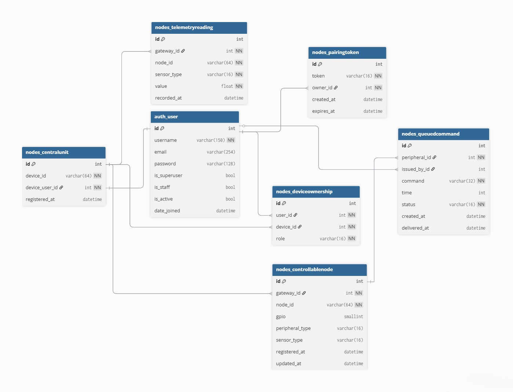

# E-Cucumbers Webapp

Dokumentacja techniczna dla centralnej części serwerowej (Webapp) projektu **E-Cucumbers**. Projekt ma na celu udostępnienie interfejsu webowego (HMI) oraz bezpiecznego API dla Jednostki Centralnej (Raspberry Pi), która kontroluje i agreguje dane z urządzeń końcowych (węzłów bazujących na RPi Pico / ESP32) w inteligentnym systemie hodowli ogórków.

---

## Spis treści
1. [Wymagania i instalacja](#1-wymagania-i-instalacja)
2. [Architektura rozwiązań](#2-architektura-rozwiązań)
3. [Widoki i funkcjonalności webowe](#3-widoki-i-funkcjonalności-webowe)
4. [Dokumentacja API (Endpointy)](#4-dokumentacja-api-endpointy)
5. [Symulator Jednostki Centralnej](#5-symulator-jednostki-centralnej)
6. [Wymagania implementacyjne dla Gateway](#6-wymagania-implementacyjne-dla-gateway)
7. [Schemat bazy danych](#7-schemat-bazy-danych)
8. [Rozwój w przyszłości](#8-rozwój-w-przyszłości)

---

## 1. Wymagania i instalacja

Projekt opiera się bazowo na frameworku **Django** i paczce **Django REST Framework (DRF)**. Jako bazę danych wykorzystuje system `SQLite` we wczesnej fazie projektu dla zachowania najwyższej prostoty – jedno z głównych rygorystycznych założeń deweloperskich to absolutne unikanie overengineeringu.

### Wymagania środowiskowe
- Python 3.10+
- Menedżer pakietów `pip` oraz `virtualenv`

### Setup projektu (Krok po kroku)

Dzięki przygotowanym narzędziom konfiguracyjnym, instalacja repozytorium na nowej maszynie jest całkowicie zautomatyzowana (zarówno dla systemu Windows, jak i środowisk Linux/macOS).

1. **Uruchomienie automatycznego skryptu (Windows / Linux):**
   W katalogu `api/` zlokalizuj skrypt konfiguracyjny odpowiedni dla Twojego środowiska i go uruchom.

   **Na systemie Windows:**
   ```bash
   setup.bat
   ```
   **Na systemie Linux / macOS:**
   ```bash
   bash setup.sh
   ```
   *Skrypt samodzielnie zajmie się:*
   * Stworzeniem izolowanego środowiska wirtualnego (`.venv`)
   * Pobraniem wszystkich pakietów z `requirements.txt` (Django, DRF, JWT, drf-spectacular, CORS)
   * Zastosowaniem wszystkich migracji bazodanowych
   * Powołaniem głównego konta administratora `admin` / `admin123`

2. **Uruchomienie serwera deweloperskiego:**
   ```bash
   .venv\Scripts\activate      # Windows
   source .venv/bin/activate   # Linux / macOS
   python manage.py runserver
   ```
   Serwer dostępny pod: `http://127.0.0.1:8000`

3. **Interaktywna dokumentacja API (Swagger):**

   Po uruchomieniu serwera dostępne są:

   | URL | Opis |
   |---|---|
   | `http://127.0.0.1:8000/api/docs/` | Swagger UI — testowanie endpointów w przeglądarce |
   | `http://127.0.0.1:8000/api/redoc/` | ReDoc — czytelna dokumentacja |
   | `http://127.0.0.1:8000/api/schema/` | Surowy plik OpenAPI 3.0 (YAML) |

---

## 2. Architektura rozwiązań

Aplikacja jest minimalnym rozwiązaniem typu monolith — łączy widoki HTML (szablony Django) z interfejsami JSON API, z wyraźnym podziałem odpowiedzialności.

* **`ecucumbers/`** — Główny moduł aplikacyjny: ustawienia silnika DRF, konfiguracja JWT, routing główny, CORS, Swagger (drf-spectacular).
* **`accounts/`** — Moduł operacji na profilach: rejestracja kont, logowanie, generowanie tokenów JWT, zarządzanie rolami użytkowników (panel admina). Zawiera zarówno widoki HTML (`urls.py`) jak i API JSON (`api_urls.py`).
* **`nodes/`** — Sub-aplikacja obsługująca cały cykl życia urządzeń IoT:
  * `PairingToken` — tymczasowy token parowania (15 min, format `TEMP-XXXX`), łączący urządzenie z właścicielem
  * `CentralUnit` — zarejestrowane gateway'e (Raspberry Pi); każdy ma konto systemowe (`device_user`) do generowania JWT
  * `DeviceOwnership` — relacja właściciel/współdzielenie z rolami `admin` / `viewer`
  * `ControllableNode` — węzeł końcowy (Pico): maksymalnie **1 czujnik** (`sensor_type`) i opcjonalnie 1 urządzenie sterowane (`gpio` + `peripheral_type`)
  * `QueuedCommand` — kolejka komend od użytkownika, odbierana przez gateway przy heartbeat; statusy: `pending` / `delivered`
  * `TelemetryReading` — append-only logi z czujników; `sensor_type` pochodzi z rejestracji węzła
* **`tests/`** — Testy integracyjne weryfikujące poprawność endpointów.

Do autoryzacji w REST API używany jest **JWT (JSON Web Tokens)** z parą kluczy `access` / `refresh`. Zarówno użytkownicy ludzcy, jak i urządzenia (gateway) używają JWT — urządzenia mają własne konta systemowe (`device_user`).

### Zasada: jeden czujnik na węzeł

Każdy fizyczny węzeł (`node_id`) podłączony do gateway'a może mieć **dokładnie jeden typ czujnika**. Typ czujnika jest deklarowany raz podczas rejestracji węzła (`/register-peripherals/`) i nie jest powtarzany przy każdym odczycie telemetrii. Dzięki temu payload telemetrii jest minimalny: `{"node_id": "Pico_01", "value": 23.5}`.

---

## 3. Widoki i funkcjonalności webowe

Routing HTML zdefiniowany w `ecucumbers/urls.py`:

| URL | Widok | Opis |
|---|---|---|
| `/` | `dashboard_view` | Panel główny użytkownika (wymaga logowania) |
| `/simulation/` | `simulation_view` | Symulator gateway'a (tylko superuser) |
| `/accounts/register/` | `register_view` | Rejestracja przez formularz HTML |
| `/accounts/login/` | Django `LoginView` | Logowanie przez formularz HTML |
| `/accounts/logout/` | Django `LogoutView` | Wylogowanie |
| `/accounts/manage-users/` | `manage_users_view` | Zarządzanie rolami (tylko superuser) |

### Opis szablonów

* **`base.html`** — Szkielet strony z nawigacją i globalnym CSS (zielony motyw).

* **`dashboard.html`** — Rozbudowany panel użytkownika zawierający:
  * Dane konta (username, email, data dołączenia)
  * Generowanie Tokenu Parowania z odliczaniem (15 min)
  * Placeholder dla integracji Discord/SMS (planowana)
  * Przycisk panelu admina (tylko dla superuser)
  * **Dla każdej zarejestrowanej Jednostki Centralnej:**
    * Lista czujników z wykresami liniowymi w czasie rzeczywistym (Chart.js, polling co 5s przez `GET /api/nodes/telemetry/`)
    * Przełącznik zakresu wykresu: 5 minut, 15 minut, 30 minut, wszystko
    * Panel sterowania: przyciski dla LAMP (Włącz / Wyłącz / Uruchom na czas) i SPRINKLER (Nawadniaj / Wyłącz), wszystko przez `POST /api/nodes/command/`
    * Wskaźniki LED stanu urządzeń aktualizowane z historii komend (`GET /api/nodes/command/`)
    * Dziennik komend stacji (tabela z statusem `pending` / `delivered` / `executing` / `completed`, polling co 5s)
    * Przycisk wyrejestrowania stacji (`DELETE /api/nodes/register-device/`)

* **`accounts/manage_users.html`** — Panel admina: masowe zarządzanie rolami użytkowników (`superuser` / `staff` / `user`), blokada modyfikacji konta `admin`.

* **`simulation.html`** — Symulator Jednostki Centralnej (opisany szczegółowo w [rozdziale 5](#5-symulator-jednostki-centralnej)).

---

## 4. Dokumentacja API (Endpointy)

> Wszystkie endpointy API można testować interaktywnie przez Swagger UI: `http://127.0.0.1:8000/api/docs/`

### `MODUŁ: API / ACCOUNTS /`

| Metoda | Endpoint | Autoryzacja | Opis | Payload (JSON) | Odpowiedź |
|---|---|---|---|---|---|
| `POST` | `/api/accounts/register/` | ❌ Brak | Rejestracja nowego konta użytkownika | `{"username":"x", "email":"x@x.com", "password":"x"}` | `201` — `{"user": {...}, "access": "...", "refresh": "..."}` |
| `POST` | `/api/accounts/login/` | ❌ Brak | Logowanie, wystawia tokeny JWT | `{"username":"x", "password":"x"}` | `200` — `{"refresh":"...", "access":"..."}` |
| `POST` | `/api/accounts/token/refresh/` | ❌ Brak | Odświeża wygasły token `access` | `{"refresh":"<token>"}` | `200` — `{"access": "..."}` |
| `GET` | `/api/accounts/me/` | ✅ Bearer JWT (user) | Profil aktualnie zalogowanego użytkownika | — | `200` — dane użytkownika (`id`, `username`, `email`, `is_staff`, `is_superuser`) |

### `MODUŁ: API / NODES /`

| Metoda | Endpoint | Autoryzacja | Opis | Payload (JSON) | Odpowiedź |
|---|---|---|---|---|---|
| `POST` | `/api/nodes/pairing-token/` | ✅ Bearer JWT (user) | Generuje Token Parowania ważny 15 min (`TEMP-XXXX`) | — | `201` — `{"token":"TEMP-8492", "expires_at":"...", "expires_in_seconds":900}` |
| `POST` | `/api/nodes/register-device/` | ❌ Brak | Rejestruje gateway lub ponownie go rejestruje po factory reset. Tworzy konto systemowe urządzenia i nadaje właścicielowi rolę admin. | `{"device_id":"2137", "pairing_token":"TEMP-8492"}` | `200` — `{"device_id":"2137", "owner":"Jan", "access":"...", "refresh":"..."}` |
| `DELETE` | `/api/nodes/register-device/` | ✅ Bearer JWT (user) | Wyrejestrowuje gateway. Admin: usuwa urządzenie i konto systemowe. Viewer: usuwa tylko swój dostęp. | `{"device_id":"2137"}` lub `?device_id=2137` | `200` — `{"detail": "..."}` |
| `POST` | `/api/nodes/register-peripherals/` | ✅ Bearer JWT (device) | Gateway rejestruje węzły końcowe (idempotentne — upsert). Każdy węzeł może mieć czujnik (`sensor_type`) i/lub urządzenie sterowane (`gpio` + `peripheral_type`). | `{"device_id":"2137", "peripherals":[{"node_id":"Pico_01", "gpio":1, "peripheral_type":"LAMP", "sensor_type":"temperature"}]}` | `200` — `{"device_id":"2137", "registered_count":1, "peripherals":[...]}` |
| `GET` | `/api/nodes/peripherals/?device_id=2137` | ✅ Bearer JWT (user lub device) | Lista węzłów gateway'a. Użytkownik musi mieć dowolną rolę w `DeviceOwnership`. | — | `200` — `{"device_id":"2137", "peripherals":[...]}` węzły z `allowed_commands` per typ |
| `POST` | `/api/nodes/command/` | ✅ Bearer JWT (user) | Kolejkuje komendę do węzła końcowego (status `pending`). Czas podawany w minutach. | `{"device_id":"2137", "node_id":"Pico_01", "gpio":1, "command":["TURN_ON_FOR", 480]}` | `201` — zakolejkowana komenda |
| `GET` | `/api/nodes/command/?device_id=2137` | ✅ Bearer JWT (user lub device) | Historia komend dla gateway'a (domyślnie ostatnie 20). Dostępny dla właściciela i konta urządzenia. | `?device_id=2137&limit=50` | `200` — lista `QueuedCommand` posortowana malejąco po `created_at` |
| `POST` | `/api/nodes/heartbeat/` | ✅ Bearer JWT (device) | Gateway odbiera wszystkie komendy `pending` i oznacza je jako `delivered`. Tożsamość gateway'a wynika z JWT. | — (brak payloadu) | `200` — `{"device_id":"2137", "pending_count":5, "commands":[...]}` |
| `POST` | `/api/nodes/telemetry/` | ✅ Bearer JWT (device) | Gateway przesyła odczyt z czujnika węzła. `sensor_type` jest pobierany automatycznie z rejestracji węzła — nie trzeba go podawać. Węzeł musi być wcześniej zarejestrowany i mieć `sensor_type`. | `{"node_id":"Pico_01", "value":23.5}` | `201` — `{"id":..., "node_id":"Pico_01", "sensor_type":"temperature", "value":23.5, "recorded_at":"..."}` |
| `GET` | `/api/nodes/telemetry/?device_id=2137` | ✅ Bearer JWT (user lub device) | Pobiera historię odczytów telemetrii dla gateway'a. Opcjonalne filtrowanie po typie czujnika, węźle (`node_id`) i limicie. Wyniki zwracane w porządku rosnącym (`recorded_at` ASC) — gotowe do wykresów. | `?device_id=2137&node_id=Pico_01&sensor_type=temperature&limit=100` | `200` — lista `TelemetryReading` |
| `GET` | `/api/nodes/user-devices/` | ✅ Bearer JWT (user) | Lista wszystkich gateway'ów, do których użytkownik ma dostęp (własne i współdzielone) wraz z rolą i datą rejestracji. | — | `200` — `[{"device_id":"...", "role":"admin", "registered_at":"..."}]` |

#### Szczegóły walidacji `/api/nodes/command/` (POST)

Serwer odrzuca komendę z błędem `400`, jeśli:
- `device_id` nie istnieje
- węzeł `node_id` + `gpio` nie jest zarejestrowany pod tym gateway'em
- nazwa komendy (`command[0]`) nie należy do zbioru legalnych komend dla danego `peripheral_type`
- komenda wymaga parametru czasu (np. `TURN_ON_FOR`), ale nie podano `command[1]`
- `command[1]` (czas) nie jest dodatnią liczbą całkowitą
- komenda nie wymaga czasu, ale `command[1]` zostało podane

#### Szczegóły walidacji `/api/nodes/register-peripherals/` (POST)

Serwer odrzuca z błędem `400`, jeśli:
- lista `peripherals` jest pusta
- dwa węzły w liście mają ten sam `node_id`
- węzeł nie ma ani `sensor_type`, ani pary `gpio` + `peripheral_type`
- podano `gpio` bez `peripheral_type` lub odwrotnie

#### Typy urządzeń i ich komendy

| `peripheral_type` | Dostępne komendy | Parametr |
|---|---|---|
| `LAMP` | `TURN_ON` | — |
| `LAMP` | `TURN_OFF` | — |
| `LAMP` | `TURN_ON_FOR` | `time` (minuty, wymagany, dodatnia int) |
| `SPRINKLER` | `WATER_PUMP_ON` | `time` (minuty, wymagany, dodatnia int) |
| `SPRINKLER` | `TURN_OFF` | — |

#### Typy czujników (`sensor_type`)

| Wartość | Opis |
|---|---|
| `temperature` | Temperatura (°C) |
| `humidity` | Wilgotność (%) |
| `light` | Natężenie światła (lux) |

#### Format payloadów odpowiedzi

**`PeripheralSerializer`** (węzeł):
```json
{
  "id": 1,
  "node_id": "Pico_01",
  "gpio": 1,
  "peripheral_type": "LAMP",
  "sensor_type": "temperature",
  "allowed_commands": [
    {"name": "TURN_ON", "params": []},
    {"name": "TURN_OFF", "params": []},
    {"name": "TURN_ON_FOR", "params": [{"key": "time", "unit": "minutes", "type": "int"}]}
  ],
  "updated_at": "2026-05-25T10:00:00Z"
}
```

**`QueuedCommandSerializer`** (komenda w historii):
```json
{
  "id": 42,
  "node_id": "Pico_01",
  "gpio": 1,
  "peripheral_type": "LAMP",
  "command": "TURN_ON_FOR",
  "time": 480,
  "status": "delivered",
  "created_at": "2026-05-25T10:00:00Z",
  "delivered_at": "2026-05-25T10:01:00Z"
}
```

**`GatewayCommand`** (uproszczony format komendy w heartbeat):
```json
{
  "id": 42,
  "node_id": "Pico_01",
  "gpio": 1,
  "command": "TURN_ON"
}
```

**`TelemetryReadingSerializer`** (odczyt):
```json
{
  "id": 101,
  "node_id": "Pico_01",
  "sensor_type": "temperature",
  "value": 23.5,
  "recorded_at": "2026-05-25T10:05:00Z"
}
```

---

## 5. Symulator Jednostki Centralnej

**URL:** `/simulation/` — dostępny wyłącznie dla kont z uprawnieniami `superuser`.

Symulator to wbudowane narzędzie deweloperskie umożliwiające pełne przetestowanie protokołu komunikacji gateway→API bez potrzeby posiadania fizycznego sprzętu (Raspberry Pi / Pico). Działa w przeglądarce i w pełni emuluje zachowanie firmware'u gateway'a.

### Funkcjonalności symulatora

#### 1. Rejestracja stacji (Pairing)
Symulator wyświetla formularz rejestracji z polami:
- **ID Urządzenia** — dowolny unikalny string (domyślnie `CENTRAL_SIM_01`)
- **Token parowania** — wygenerowany na Dashboardzie token `TEMP-XXXX`

Po kliknięciu „Zarejestruj i uruchom stację" symulator wywołuje `POST /api/nodes/register-device/` i zapisuje otrzymane tokeny JWT (`access` + `refresh`) w `localStorage` przeglądarki. Stan jest trwały między odświeżeniami strony.

#### 2. Zarządzanie węzłami (Peripherals)
Panel lewej kolumny pozwala dodawać i usuwać węzły końcowe w czasie rzeczywistym:

- **Dodawanie węzła:** formularz z polami: ID Węzła (`node_id`), numer GPIO, typ peryferia (LAMP / SPRINKLER / brak), typ czujnika (temperature / humidity / light / brak)
- Walidacja po stronie UI: węzeł musi mieć co najmniej czujnik lub element sterowany; `gpio` i `peripheral_type` muszą być podane razem; node_id musi być unikalny
- **Usuwanie węzła:** natychmiast zatrzymuje powiązane timery telemetrii i usuwa stan
- **Auto-synchronizacja:** każda zmiana w liście węzłów wyzwala (z debouncingiem 1,2s) automatyczne wywołanie `POST /api/nodes/register-peripherals/`, które aktualizuje konfigurację na serwerze (operacja idempotentna — upsert)

#### 3. Heartbeat i odbiór komend
Prawa kolumna zawiera kontrolkę heartbeatu:

- Konfigurowalna częstotliwość odpytywania (2–60 sekund, domyślnie 5s)
- Przycisk Start/Stop z animowanym wskaźnikiem pulsu
- Przy każdym wywołaniu symulator wysyła `POST /api/nodes/heartbeat/` (bez payloadu, autoryzacja przez JWT urządzenia)
- Otrzymane komendy (`pending_count > 0`) są logowane w konsoli i **natychmiast wykonywane** na symulatorze (zmiana stanu LED urządzenia)

#### 4. Stan urządzeń sterowanych
Dedykowany panel wyświetla bieżący stan każdego węzła z elementem sterowanym:
- Wskaźnik LED (zielony dla LAMP, niebieski dla SPRINKLER) z efektem świecenia CSS
- Tekst stanu: `WYŁĄCZONY` / `WŁĄCZONY` / `WŁĄCZONY (Pozostało: MM:SS)`
- Dla komend czasowych (`TURN_ON_FOR`, `WATER_PUMP_ON`) symulator oblicza czas pozostały na podstawie `delivered_at` z serwera i odlicza w dół w czasie rzeczywistym (ticker co 1s)
- **Przywracanie stanu po odświeżeniu strony:** przy inicjalizacji symulator wywołuje `GET /api/nodes/command/?device_id=...&limit=20` i odtwarza stan ostatnich dostarczonych komend

#### 5. Symulacja telemetrii czujników
Dla każdego węzła z zarejestrowanym czujnikiem dostępna jest kontrolka:
- **Suwak + pole numeryczne** — ustawianie bieżącej wartości (zakresy: temperatura 10–45°C, wilgotność 20–99%, światło 0–20000 lux)
- **Tryb generowania wartości:**
  - `Manualny (Suwak)` — wysyła dokładnie wartość z suwaka
  - `Losowy (Szum)` — dodaje losowy szum (±0,2°C dla temperatury, ±1 dla pozostałych) i przesuwa suwak
  - `Sinusoida (Autogrow)` — symuluje dobowy cykl, generując sinusoidę między min a max zakresu czujnika
- Przycisk **Start/Stop** — włącza/wyłącza automatyczne wysyłanie telemetrii co 5 sekund
- Każde wysłanie: `POST /api/nodes/telemetry/` z payloadem `{"node_id": "...", "value": ...}`

#### 6. Konsola logów stacji
Terminal w dolnej sekcji strony loguje wszystkie zdarzenia z kolorowym kodowaniem:
- 🔵 **Systemowe** — inicjalizacja, weryfikacja połączenia, synchronizacja
- 🟢 **API OK** — udane wywołania endpointów
- 🔴 **API Error** — błędy odpowiedzi
- 🩵 **Telemetria** — wysyłane odczyty z czujników
- 🟠 **Komendy** — odebrane i wykonane komendy sterujące

Przyciski: **Wyczyść** (czyści terminal) i **Kopiuj** (kopiuje cały log do schowka).

#### 7. Obsługa JWT i factory reset
- Symulator automatycznie wykrywa wygaśnięcie tokenu `access` (HTTP 401) i próbuje go odświeżyć przez `POST /api/accounts/token/refresh/`
- Jeśli odświeżenie też zawiedzie (lub zwróci 403), wykonywany jest automatyczny **Factory Reset**
- Przycisk „Factory Reset (Rozłącz stację)" zatrzymuje wszystkie timery, czyści `localStorage` i wraca do ekranu rejestracji

---

## 6. Wymagania implementacyjne dla Gateway

Poniższy rozdział opisuje co musi zostać zaimplementowane w oprogramowaniu fizycznego lub wirtualnego **gateway'a** (Raspberry Pi), aby w pełni integrować się z API serwera.

### 6.1 Konfiguracja i przechowywanie stanu

Gateway musi trwale przechowywać (np. plik `station.json` lub odpowiednik):
- `device_id` — unikalny identyfikator urządzenia (string, max 64 znaki)
- `access_token` — aktualny token JWT (access)
- `refresh_token` — token JWT do odnawiania sesji
- `owner` — nazwa użytkownika właściciela (informacyjnie)

### 6.2 Procedura rejestracji (Pairing)

1. Użytkownik generuje Token Parowania na Dashboardzie webowym (format `TEMP-XXXX`, ważny 15 minut)
2. Gateway wywołuje:
   ```
   POST /api/nodes/register-device/
   Content-Type: application/json

   {
     "device_id": "<unikalny_id>",
     "pairing_token": "TEMP-XXXX"
   }
   ```
3. Serwer zwraca `200 OK` z tokenami JWT:
   ```json
   {
     "device_id": "RPi_greenhouse_01",
     "owner": "jan_kowalski",
     "access": "<jwt_access_token>",
     "refresh": "<jwt_refresh_token>"
   }
   ```
4. Gateway zapisuje oba tokeny w pamięci trwałej i używa `access` do wszystkich kolejnych żądań.

> **Re-rejestracja po factory reset:** Jeśli gateway z tym samym `device_id` już istnieje, właściciel (weryfikowany tokenem parowania) może go ponownie zarejestrować — serwer odda nowe tokeny JWT dla istniejącego konta urządzenia.

### 6.3 Rejestracja peryferiów

Po pomyślnej rejestracji, **natychmiast** (lub po każdej zmianie podłączonego sprzętu) gateway musi zarejestrować wszystkie swoje węzły końcowe:

```
POST /api/nodes/register-peripherals/
Authorization: Bearer <access_token>
Content-Type: application/json

{
  "device_id": "RPi_greenhouse_01",
  "peripherals": [
    {
      "node_id": "Pico_01",
      "gpio": 1,
      "peripheral_type": "LAMP",
      "sensor_type": "temperature"
    },
    {
      "node_id": "Pico_02",
      "gpio": 2,
      "peripheral_type": "SPRINKLER",
      "sensor_type": "humidity"
    },
    {
      "node_id": "Pico_03",
      "gpio": null,
      "peripheral_type": null,
      "sensor_type": "light"
    }
  ]
}
```

**Zasady:**
- Operacja jest **idempotentna** (upsert) — bezpieczne wielokrotne wywołanie
- Każdy `node_id` musi być unikalny w obrębie jednego gateway'a
- Węzeł musi mieć co najmniej `sensor_type` **lub** parę `gpio` + `peripheral_type`
- `gpio` and `peripheral_type` muszą być podane **razem** albo oba pominięte/null
- Dozwolone wartości `peripheral_type`: `LAMP`, `SPRINKLER`
- Dozwolone wartości `sensor_type`: `temperature`, `humidity`, `light`

Odpowiedź sukces `200 OK`:
```json
{
  "device_id": "RPi_greenhouse_01",
  "registered_count": 3,
  "peripherals": [...]
}
```

### 6.4 Heartbeat — cykliczne odpytywanie komend

Gateway musi w regularnych odstępach czasu (zalecane: co 5–30 sekund) wywołać heartbeat:

```
POST /api/nodes/heartbeat/
Authorization: Bearer <access_token>
```

**Brak payloadu** — tożsamość gateway'a wynika wyłącznie z tokenu JWT.

Odpowiedź `200 OK`:
```json
{
  "device_id": "RPi_greenhouse_01",
  "pending_count": 2,
  "commands": [
    {
      "id": 42,
      "node_id": "Pico_01",
      "gpio": 1,
      "command": "TURN_ON"
    },
    {
      "id": 43,
      "node_id": "Pico_02",
      "gpio": 2,
      "command": "TURN_OFF"
    }
  ]
}
```

**Przetwarzanie komend przez gateway:**
- Jeśli `pending_count > 0`, gateway iteruje po tablicy `commands`
- Dla każdej komendy: identyfikuje węzeł Pico po `node_id` i `gpio`, a następnie wykonuje komendę.
- Implementacja komend na poziomie fizycznego pinu (maksymalnie uproszczona):
  - `TURN_ON` — ustawia stan pinu GPIO na wysoki (ON / włączony)
  - `TURN_OFF` — ustawia stan pinu GPIO na niski (OFF / wyłączony)
- **Zarządzanie czasem trwania (Timery):** Bramka nie implementuje żadnych timerów ani odliczania czasu w dół. Jeśli komenda została uruchomiona na określony czas (np. zraszacz na 15 minut), to aplikacja webowa (serwer) automatycznie odlicza ten czas i po jego upływie kolejkuje dla bramki nową komendę `TURN_OFF`. Bramka po prostu odbiera ją w kolejnym heartbeacie i fizycznie wyłącza pin.
- Po dostarczeniu heartbeatu serwer **automatycznie** zmienia status komend z `pending` na `delivered` — gateway nie musi tego potwierdzać osobno.

### 6.5 Wysyłanie telemetrii

Dla każdego węzła z zarejestrowanym `sensor_type`, gateway musi cyklicznie odczytywać dane i wysyłać je do API:

```
POST /api/nodes/telemetry/
Authorization: Bearer <access_token>
Content-Type: application/json

{
  "node_id": "Pico_01",
  "value": 23.5
}
```

**Ważne zasady:**
- `sensor_type` **nie jest podawany** — serwer pobiera go automatycznie z rejestracji węzła
- Węzeł **musi być wcześniej zarejestrowany** przez `/register-peripherals/` i mieć ustawiony `sensor_type`
- Próba wysłania telemetrii dla niezarejestrowanego węzła lub węzła bez czujnika zwróci `400 Bad Request`
- Wartość (`value`) jest liczbą zmiennoprzecinkową (`float`)
- Rekordy są tylko dopisywane (append-only) — nigdy nie nadpisywane

Odpowiedź sukces `201 Created`:
```json
{
  "id": 101,
  "node_id": "Pico_01",
  "sensor_type": "temperature",
  "value": 23.5,
  "recorded_at": "2026-05-25T10:05:00Z"
}
```

### 6.6 Odświeżanie tokenów JWT

Gateway musi obsługiwać wygasanie tokenów:

1. Każde żądanie z wygasłym `access` zwróci `401 Unauthorized`
2. Gateway wywołuje:
   ```
   POST /api/accounts/token/refresh/
   Content-Type: application/json

   {
     "refresh": "<refresh_token>"
   }
   ```
3. Odpowiedź `200 OK`:
   ```json
   {
     "access": "<nowy_access_token>"
   }
   ```
4. Gateway zapisuje nowy `access` i ponawia oryginalne żądanie
5. Jeśli refresh też zawiedzie (`401`), konieczna jest ponowna procedura parowania

### 6.7 Rekomendowana pętla główna gateway'a

```
[Uruchomienie]
    ↓
Wczytaj stan z pliku (device_id, access, refresh)
    ↓
Czy mam tokeny? → NIE → Procedura parowania (czekaj na token TEMP-XXXX od użytkownika)
    ↓ TAK
POST /register-peripherals/ — zarejestruj aktualne węzły
    ↓
[Pętla główna, tick co 5s]
    ├── POST /heartbeat/ → wykonaj komendy
    ├── (co N-ty tick) POST /telemetry/ dla każdego sensora
    └── Jeśli 401 → spróbuj refresh → jeśli fail → restart parowania
```

### 6.8 Kody odpowiedzi HTTP, które gateway musi obsługiwać

| Kod | Znaczenie | Zalecana akcja |
|---|---|---|
| `200 OK` | Sukces | Przetworz odpowiedź |
| `201 Created` | Zasób utworzony | Przetworz odpowiedź |
| `400 Bad Request` | Błąd walidacji danych | Zaloguj błąd, nie powtarzaj żądania bez naprawy danych |
| `401 Unauthorized` | Wygasły lub brakujący token | Spróbuj odświeżyć `access` przez `/token/refresh/` |
| `403 Forbidden` | Brak uprawnień (np. nie-device próbuje heartbeat) | Zaloguj błąd krytyczny, rozpocznij procedurę parowania |
| `404 Not Found` | Zasób nie istnieje (np. nieznany `device_id`) | Zaloguj błąd, sprawdź konfigurację |

---

## 7. Schemat bazy danych



---

## 8. Rozwój w przyszłości

1. **Faza 2 — Telemetria i sterowanie:** ✅ Zrealizowane — endpointy `telemetry/`, `command/`, `heartbeat/` są gotowe. Dashboard zawiera wykresy telemetrii i panel sterowania.
2. **Faza 3 — Współdzielenie uprawnień:** Generowanie kodów zaproszeniowych (`share-code/`), dołączanie do istniejącej Jednostki Centralnej (`claim-shared/`), zarządzanie rolami per urządzenie dla kont Viewer.
3. **Alerty Discord (Opcjonalnie):** Wysyłanie powiadomień o anomaliach (np. temperatura poza zakresem) przez WebHook na czat Discord.
4. **Automatyczne reguły sterowania:** Definiowanie reguł „jeśli temperatura > X, włącz wentylator na Y minut" bezpośrednio w Dashboardzie.
